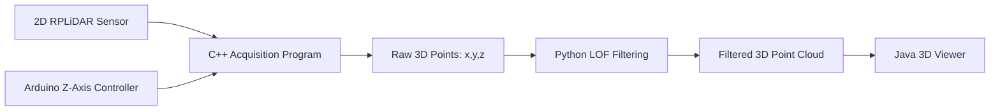

# 2D LiDAR-Based 3D Point Cloud Reconstruction Framework

This repository contains the source code and sample data for "A Low-Cost Visual Computing Framework for 3D Point Cloud Reconstruction Using Vertically Translated 2D LIDAR" paper. 

The main contribution of the project is the conversion of sequential 2D LiDAR scans into a 3D point cloud by synchronizing LiDAR polar measurements with the vertical displacement reported by an Arduino-controlled lead-screw mechanism.

## Repository Purpose

This package is intended to support reproducibility for a research submission to *The Visual Computer*. It provides the acquisition, reconstruction, filtering, and visualization components required to reproduce the experimental point-cloud generation pipeline.

## System Overview

The reconstruction process combines:

1. **2D LiDAR scan acquisition** using the SLAMTEC/RPLiDAR SDK.
2. **Z-axis motion control** using Arduino and a stepper motor.
3. **3D coordinate reconstruction** using cylindrical-to-Cartesian conversion.
4. **Outlier filtering** using Local Outlier Factor.
5. **Interactive point-cloud visualization** using a Java Swing interface.



## Coordinate Reconstruction Model

Each LiDAR measurement provides a 2D polar point:

- angle: `theta`
- distance: `r`

The Arduino provides the current vertical displacement:

- height: `z`

The 3D point is reconstructed as:

```text
x = r * cos(theta)
y = r * sin(theta)
z = current Z position from Arduino
```

The output format is:

```text
x:<value>,y:<value>,z:<value>
```

Example:

```text
x:4823.97,y:15.7248,z:0
x:4847.81,y:43.2255,z:0
```

## Folder Structure

```text
.
├── firmware/
│   └── arduino_z_axis_controller/
│       └── arduino_z_axis_controller.ino
├── src/
│   ├── cpp/
│   │   └── lidar_acquisition/
│   │       └── main.cpp
│   ├── java/
│   │   └── viewer/
│   │       ├── Surface.java
│   │       ├── surface.png
│   │       └── lib/jSerialComm-2.11.2.jar
│   └── python/
│       └── filter_lof.py
├── third_party/
│   └── rplidar_sdk/
├── data/
│   ├── raw/
│   ├── processed/
│   └── sample/
├── docs/
├── scripts/
├── requirements.txt
├── CITATION.cff
└── LICENSE
```

## Main Components

### 1. Arduino Z-Axis Controller

File:

```text
firmware/arduino_z_axis_controller/arduino_z_axis_controller.ino
```

This firmware:

- receives the desired scan height from the host computer,
- waits for a physical button press,
- moves the stepper motor along the Z axis,
- streams the current Z position through serial communication,
- sends `off` when the scan cycle is complete.

### 2. C++ LiDAR Acquisition and 3D Reconstruction

File:

```text
src/cpp/lidar_acquisition/main.cpp
```

This program:

- connects to the RPLiDAR sensor,
- connects to the Arduino serial port,
- reads the current Z displacement,
- converts LiDAR 2D polar measurements into 3D Cartesian coordinates,
- saves the reconstructed point cloud to a text file.

Example command on Windows:

```bat
ultra_simple.exe --channel --serial COM7 115200 COM5 200 data/raw/raw_points.txt
```

Arguments:

```text
COM7                 LiDAR serial port
115200               LiDAR baud rate
COM5                 Arduino serial port
200                  scan height in mm
data/raw/raw_points.txt  output point-cloud file
```

### 3. Python Point-Cloud Filtering

File:

```text
src/python/filter_lof.py
```

This script removes isolated noisy points using Local Outlier Factor.

Run:

```bash
python src/python/filter_lof.py data/raw/raw_points.txt data/processed/filtered_points.txt
```

A sample test is available:

```bat
scripts
un_filter_example.bat
```

### 4. Java Viewer and Scan Launcher

File:

```text
src/java/viewer/Surface.java
```

This Java Swing application:

- starts a LiDAR scan through the C++ executable,
- runs the Python filtering script,
- loads reconstructed points,
- visualizes the point cloud interactively,
- supports rotation, zooming, and point inspection.

Run the viewer on Windows:

```bat
scripts
un_viewer.bat
```

## Installation

### Python

```bash
pip install -r requirements.txt
```

### Java

Install a JDK. Java 8 or newer should work.

The repository includes `jSerialComm-2.11.2.jar` for COM-port selection from the Java GUI.

### C++ / RPLiDAR SDK

The C++ acquisition program depends on the SLAMTEC/RPLiDAR SDK provided in:

```text
third_party/rplidar_sdk/
```

Build the C++ executable using Visual Studio on Windows, linking against the RPLiDAR SDK includes and source files. The generated executable should be placed in:

```text
bin/ultra_simple.exe
```

The Java GUI expects this path by default.

## Reproducibility Workflow

1. Upload the Arduino firmware to the Arduino board.
2. Connect the RPLiDAR sensor and Arduino to the computer.
3. Build the C++ acquisition program.
4. Run the Java viewer.
5. Select the LiDAR and Arduino COM ports.
6. Enter the target scan height.
7. Press the physical button to start the scan.
8. The system generates raw 3D points.
9. Python filtering removes outliers.
10. The Java viewer displays the reconstructed 3D point cloud.

## Sample Data

The folder `data/sample/` contains example point-cloud files:

```text
raw_points_example.txt
filtered_points_example.txt
```

These files allow testing the viewer and filtering scripts without hardware.

## Notes

The complete pipeline is included to support reproducibility:

- Arduino motion-control firmware,
- C++ LiDAR acquisition and 3D reconstruction source code,
- Python point-cloud filtering,
- Java visualization interface,
- sample reconstructed point-cloud files,
- documentation and usage instructions.


## Citation

If you use this code, dataset, or reconstruction framework in your research, please cite the associated manuscript:

Mohamed Bakali El Mohamadi, Maryem Ait Hammou, Issam Elafi,
Nabila Zrira, and Khadija Ouazzani-Touhami.

"A Low-Cost Visual Computing Framework for 3D Point Cloud Reconstruction Using Vertically Translated 2D LIDAR"

Submitted to The Visual Computer (under review).

Source code and datasets:
https://github.com/mbakali-elmohamadi-hub/2D-LIDAR-TO-3D-RECONSTRUCTION.git

After public release, update the repository URL and Zenodo DOI in `CITATION.cff`.

## Zenodo DOI Release

https://doi.org/10.5281/zenodo.20403041

## License

This repository is released under the MIT License for the original project files. Third-party dependencies remain subject to their respective licenses.
